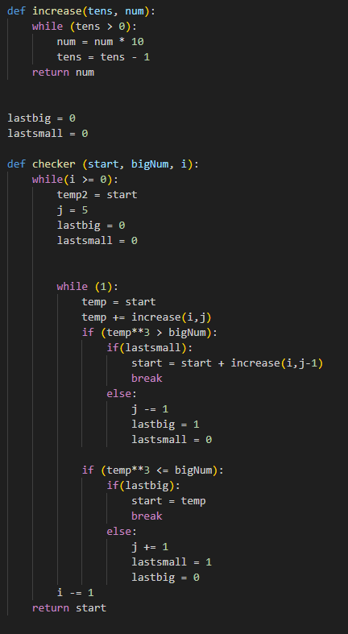
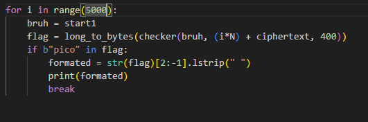

## Mini RSA Pico CTF Writeup

April 15th 2024
By: Ryan Fraser
From: The PicoCTF [website]("https://picoctf.org/")

---

### The Problem: 

What happens if you have a small exponent? There is a twist though, we padded the plaintext so that (M ** e) is just barely larger than N. Let's decrypt this: ciphertext
> The Ciphertext file can be located in the same folder as this file

---

### My Approach

#### First Look:

Looking inside of the ciphertext file, we can see that we are given N, e, and a ciphertext. The important thing to note here is that e = 3 which is very small. This along with the problem statement means that the message(m), raised to power e is only slighly bigger than N, we can use this fact to our advantage!

We know that the ciphertext $c = m^e \% N$, Once can think of the modulo operator as subtracting the modulus from our $m^e$ untill we have subratcted so many modulus that our number is now smaller than the modulus. For example:

$9 \% 8 = 9 - 8 = 1$

$25 \% 9 = 25 -9 = 16 - 9 = 7$

This means that we can now say that $\exists i \in \mathbf N (c = m^e - iN)$, and that $\exists i \in \mathbf N ((c + iN)^{\frac 1 e} = m)$

One of the hints for this problem tells us that we shouldn't have to make too many guesses, so now we know our approach! We need to find the cubed root of $c+iN$ for some number of i's, and see if it contains the flag!

---

#### Implementation

At first I wasn't too sure about how to create a cubed root function, so eventually I decided on a method that uses a small shortcut from a general root method. My approach requires you to know approximatly how many digits the cubed root of the a number actually is. In this case we can find that $iN + c$ is approximatly 1000-1050 digits long, which means the cubed root is about 1/3 of those digits. For my approach, I first picked a large enough number, in my case I chose 400 digits for the cubed root since I knew this would be plenty. I then worked backwards to the cubed root, starting from the most significant bit. First I created a temporary number, and made its most significant digit 5. I then cubed the temporary number and compared it to $iN +c$. If the number was too large, I decreased the most significant digit and tried again, Too small, I increased it, and if perfect, we have found our number. I then did this for the second most significant digit, then the third and so on.

Finally, The only part that was left was to loop though different values of i, and check if we found the flag, which can be done by searching for pico in the result produced in each itteration. I had some trouble with this part, and had to search how to seach an integer for pico. I chsose 5000 values of i to start, and did manage to find the flag in this time!

